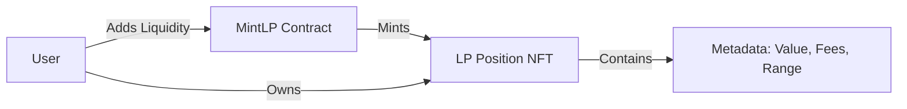

# 🦄 MintLP: The Future of NFT-Based Liquidity


**MintLP** is a decentralized ACMM (Automated Concentrated Market Maker) built on **Aptos** that redefines liquidity provision by tokenizing LP positions as **Data-Rich NFTs**.

> 🏆 **Built for Cosmohack Hackathon**

---

## 💥 The Problem vs. Solution

Traditional AMMs treat liquidity providers as fungible numbers. We treat them as unique investors.

| Feature | ❌ Traditional AMMs | ✅ MintLP (Our Solution) |
| :--- | :--- | :--- |
| **Liquidity Representation** | Fungible ERC-20 Tokens | **Non-Fungible Tokens (NFTs)** |
| **Capital Efficiency** | Low (Lazy Liquidity) | **High (Concentrated/Range)** |
| **Data Visibility** | Hidden in rigid contracts | **Visual Metadata (Fees, PnL)** |
| **Transferability** | Complex (Token Transfers) | **Simple (Trade NFT on Marketplace)** |

---

## 💎 Key Innovation: NFT Positions

Every time you add liquidity, you mint a unique **NFT Position**.
This NFT contains all your position data:
*   💰 **Principal Value**
*   📈 **Accumulated Fees**
*   📉 **Impermanent Loss Stats**
*   ⏳ **Age & Maturity**



---

## 🏗 System Architecture

We utilize a **Hybrid Architecture** for the Hackathon Demo to ensure instant feedback and zero-cost testing for judges.

```mermaid
dropdown
sequenceDiagram
    participant User
    participant Frontend as React App
    participant Wallet as Aptos Wallet (Petra)
    participant MockEngine as Simulation Engine
    participant Blockchain as Aptos Network

    User->>Frontend: Connect Wallet
    alt Real Wallet Found
        Frontend->>Wallet: Request Connection
        Wallet-->>Frontend: Signed Address
    else No Wallet (Demo Mode)
        Frontend->>MockEngine: Auto-Login Demo User
        MockEngine-->>Frontend: Mock Session
    end

    User->>Frontend: Add Liquidity
    alt Smart Contract Mode
        Frontend->>Wallet: Sign Transaction
        Wallet->>Blockchain: Execute Move Module
    else Mock Mode (Fallback)
        Frontend->>MockEngine: Calculate Curve Math
        MockEngine->>MockEngine: Generate NFT Metadata
        MockEngine-->>Frontend: Return Success Hash
    end
```

---

## 🚀 Features

*   **Dual-Engine Swap**:
    *   🔵 **Constant Product (x*y=k)** for volatile pairs.
    *   🔴 **StableSwap (x+y=k)** for stable pairs (USDC/USDT).
*   **Smart Routing**: Automatically finds the best pool for your trade.
*   **Visual Portfolio**: View your LP NFTs in a gallery view.
*   **Mock Wallet**: Built-in wallet simulation for users without extensions.

---

## 🛠 Tech Stack

*   **Frontend**: React 18, Vite, Tailwind CSS, Shadcn/ui
*   **Blockchain**: Aptos (Move Language)
*   **Integration**: Aptos Wallet Adapter
*   **Design**: Glassmorphism (CSS3 Backdrop Filter)

---

## 🏁 Getting Started

### Prerequisites
*   Node.js v16+
*   npm or yarn

### Installation

1.  **Clone the Repo**
    ```bash
    git clone https://github.com/your-username/mintlp.git
    cd mintlp
    ```

2.  **Install Dependencies**
    ```bash
    npm install
    ```

3.  **Run Development Server**
    ```bash
    npm run dev
    ```

4.  **Open in Browser**
    Visit `http://localhost:5173`.
    *   If you don't have a wallet, click "Connect" and it will auto-enable **Demo Mode**.

---

## 🗺 Roadmap

- [x] **Phase 1: Concept & Simulation** (Current)
    - [x] Core AMM Logic (Swap/Liquidity)
    - [x] NFT Metadata Generation
    - [x] Frontend Simulation
- [ ] **Phase 2: Testnet Deployment**
    - [ ] Deploy Move Modules to Aptos Testnet
    - [ ] Indexer Integration
- [ ] **Phase 3: Mainnet & Marketplace**
    - [ ] Audit & Launch
    - [ ] Secondary Market for LP NFTs

---
## 🔴 Live Demo
👉 https://mint-lp.vercel.app/

*Verified by `src/verify_logic.ts` logic proof script.*
